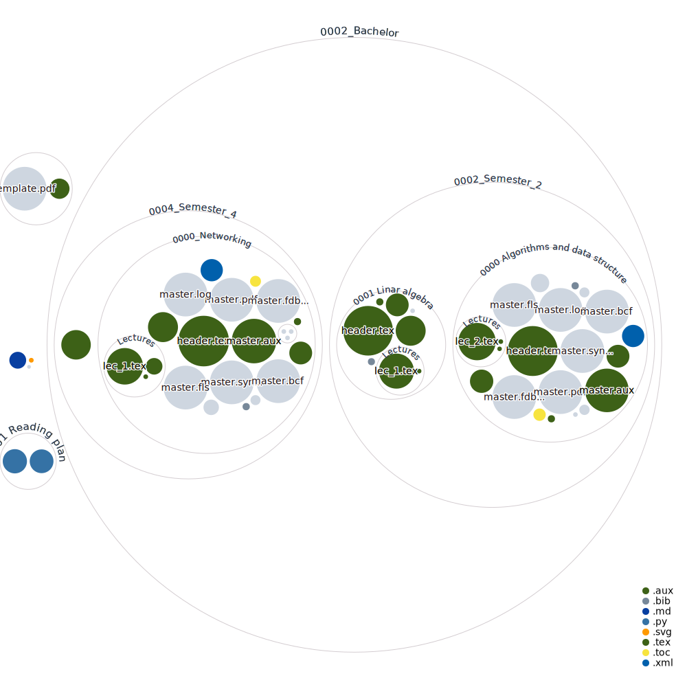

## Disclaimer and Credits

This repository serves as a collection of my personal notes and insights on books that have been instrumental during my academic journey. It is important to note that, for illustrative purposes, I have included images from these books to accompany my notes. These images are utilized under the principle of fair use, aiming solely to enrich my personal commentary and analyses. **The repository does not host full copies of the books.**

The intellectual property rights for all materials derived from these books, including but not limited to images and textual content, are retained by their original authors, publishers, and copyright holders. The intent of this repository is strictly for educational and personal use, and it is not designed for commercial distribution or to infringe upon the rights of the copyright owners.

I express my deepest appreciation to the authors, illustrators, and publishers for their invaluable contributions to the academic resources that have significantly enriched my learning experience. Their efforts are the backbone of my academic and personal development.

For comprehensive details on the books, including titles, authors, and publication information, please consult the bibliography section of this repository.

